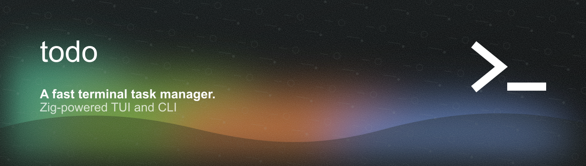

# todo



A terminal task manager written in Zig. Organises work into **Spaces → Projects → Tasks** with a TUI and a CLI.

## Build

**Requirements:** [Zig 0.14+](https://ziglang.org/download/)

```sh
zig build -Doptimize=ReleaseFast
```

The binary is at `zig-out/bin/todo`. Copy it somewhere on your `$PATH`:

```sh
# macOS / Linux
cp zig-out/bin/todo ~/.local/bin/todo

# Windows (PowerShell)
Copy-Item zig-out\bin\todo.exe $env:USERPROFILE\bin\todo.exe
```

## Features

**TUI** — run `todo` with no arguments to open the interactive interface.

- Three-panel layout: Spaces / Projects / Tasks
- Navigate with arrow keys or `h j k l`; switch panels with Tab
- Add items with `a`, delete with `d`, rename with `r`
- Task detail overlay with description, subtasks, priority, due date
- Colour-code spaces and projects
- Settings overlay (`?`): progress display, priority style, compact mode, task sorting

**Compact mode** — toggleable in settings; expands the active panel to fill the terminal width.

**CLI** — scriptable access to the same data:

```sh
todo space add <name>
todo project add <space> <name>
todo task add <space> <project> <title> [--priority high|medium|low] [--due DATE]
todo task list <space> <project>
todo task done <space> <project> <id>
```

Run `todo help` for the full command reference.

**Sync integrations** — link projects to Linear, GitHub Issues, or Trello:

```sh
todo sync config --linear-key KEY
todo sync link <space> <project> --linear-team ID --linear-project ID
todo sync linear <space> <project>
```

Data is stored in `~/.todo`.
